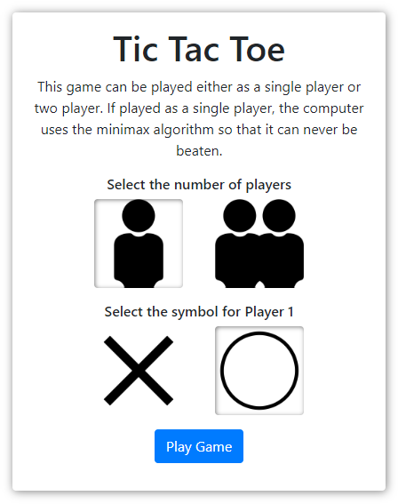
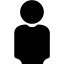
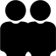
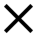
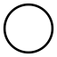

# Tic Tac Toe

This is a simple implementation of a tic tac toe game that contains a single player and two player option. 


## Getting Started

### Downloading

You can download or clone the game via the standard GitHub method. For a quick download you can just use this link: [Tic Tac Toe](https://github.com/mxrse/tic-tac-toe/archive/master.zip)

### Playing The Game

To start the game simply launch the `index.html` file and you should be presented with the following menu:



The menu itself should be pretty self-explanatory, however, a description of the choices available can be found below:

* Select the number of players:

    *  - single player mode
    *  - two player mode

* Select the symbol for Player 1:

    *  - player 1 will be a cross
    *  - player 1 will be a circle

Once you have selected the number of players and the symbol for Player 1, the `Play Game` button can be used to start the game. 

A new screen is displayed containing the board, a message bar and some buttons:


The game is played by selecting an empty position to place a symbol. If playing in single player mode, as soon you select a position the computer will then select a position. In two player mode, each player takes it in turn to select a position. The game continues until there is a winning combination or all positions have been selected.

A description of what each button does can be found below:

* `New Game` - Displays the original menu
* `Restart` - Restarts game with the same options selected from the menu

Good luck in your attempts to beat the computer :smirk:


## Minimax Algorithm

The minimax algorithm was used to create an unbeatable game of tic tac toe. It is a recursive algorithm used to choose an optimal move for a player, assuming that the opponent is also playing optimally. This helps minimize the possible loss for a worst case scenario.

### Implementation

```
function minimaxNextMove(gameState, nextPlayer) {

	// set our required variables
	let options = [];

	// go through each available move
	$.each(gameState, function(index, symbol) {
		if (symbol === symbols.blank) {
			// set our required variables
			let updatedGameState = gameState.slice();
			// update the game state with the new move and analyse
			updatedGameState[index] = nextPlayer.symbol;
			if (win(updatedGameState, nextPlayer.symbol) !== null) {
				// we have a win so add it to the options
				options.push({"position": index, "score": 1});
				return false;
			} else if (draw(updatedGameState)) {
				// we have a draw so add it to the options
				options.push({"position": index, "score": 0});
				return false;
			} else {
				// call the minimax next move function with the new player and add it to the options
				let option = minimaxNextMove(updatedGameState, nextPlayer === settings.players.playerOne ? settings.players.playerTwo : settings.players.playerOne);
				options.push({"position": index, "score": -option.score});
			}
		}
	});

	// sort the options based on highest available scores
	options.sort(function(option1, option2) {
		return option2.score - option1.score;
	});

	// filter array based on highest score and return a random option
	let bestScore = options[0].score;
	let bestOptions = options.filter(function(element) {
		return element.score === bestScore;
	});
	return bestOptions[Math.floor(Math.random() * bestOptions.length)];
}
```

Essentially we create a game tree consisting of all the possible moves that allow us to move from a state of the game to the next state. This is accomplished by recursively calling the `minimaxNextMove(gameState, nextPlayer)` function until a terminal state is reached. Upon reaching the terminal state, the outcome is assigned one of the following utilities:

* +1 - win
* -1 - loss
* 0 - draw

The minimax decision is the decision that maximises the utility assuming the opponent is playing optimally to minimize it. 

### Useful Reading

I found the following media useful when implementing the algorithm:

* [Minimax Algorithm Alpha Beta Pruning - Rashmi Jain](https://www.hackerearth.com/blog/developers/minimax-algorithm-alpha-beta-pruning/)
* [Tic Tac Toe - Creating Unbeatable AI - Greg Surma](https://towardsdatascience.com/tic-tac-toe-creating-unbeatable-ai-with-minimax-algorithm-8af9e52c1e7d)
* [How to make your Tic Tac Toe game unbeatable by using the minimax algorithm - Ahmad Abdolsaheb](https://www.freecodecamp.org/news/how-to-make-your-tic-tac-toe-game-unbeatable-by-using-the-minimax-algorithm-9d690bad4b37/)
* [Minimax Algorithm in Game Theory | Set 3 (Tic-Tac-Toe AI – Finding optimal move) - Akshay L Aradhya](https://www.geeksforgeeks.org/minimax-algorithm-in-game-theory-set-3-tic-tac-toe-ai-finding-optimal-move/)


## Technologies Used

The following technologies were used to create the game:

* [jQuery](https://jquery.com/) - Feature-rich JavaScript library used to select and manipulate HTML elements
* [Bootstrap](https://getbootstrap.com/) - Toolkit used to help style the game